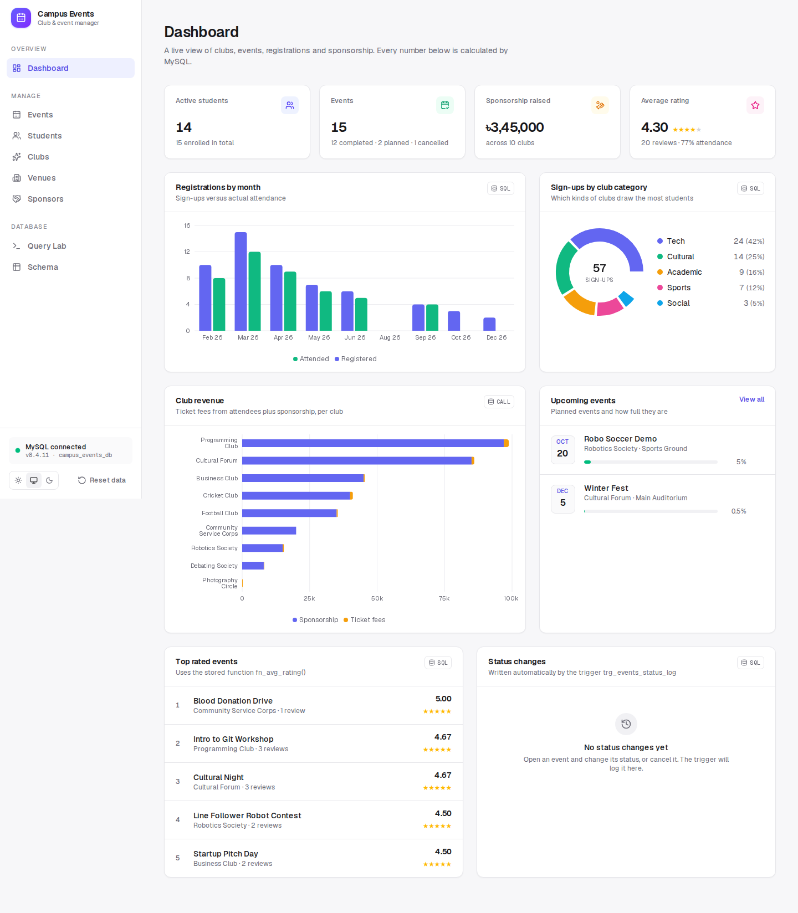
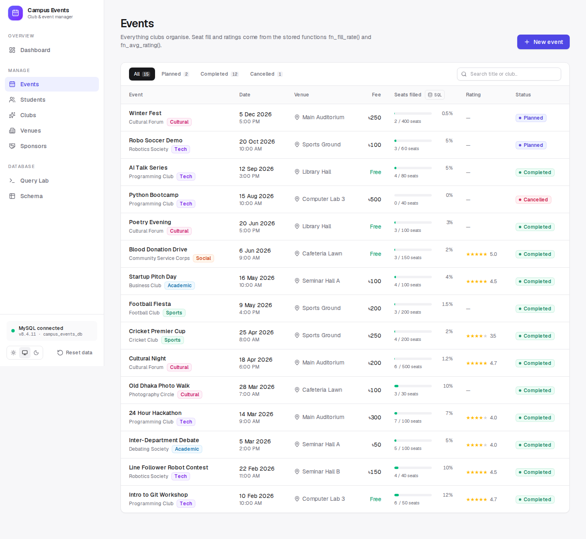
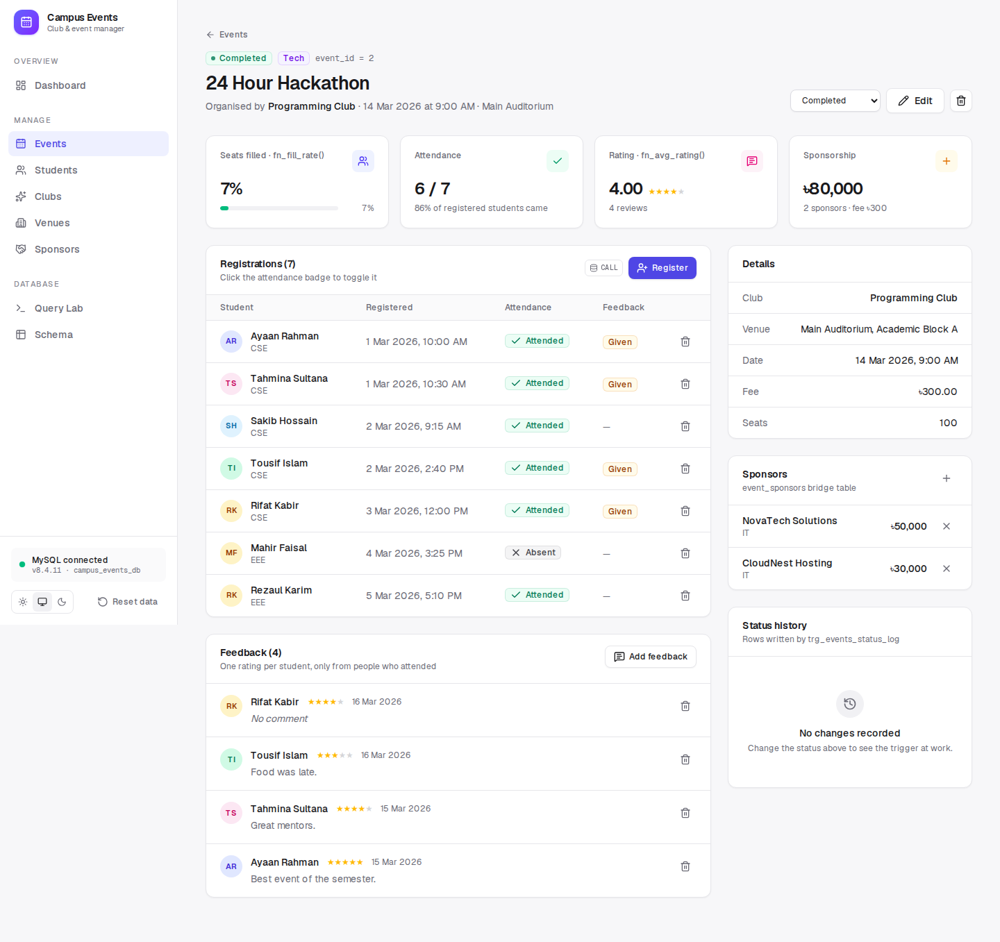
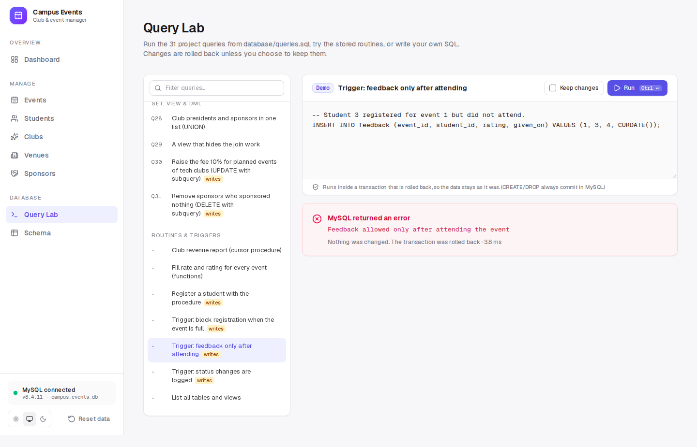
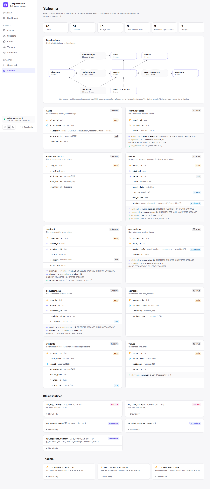
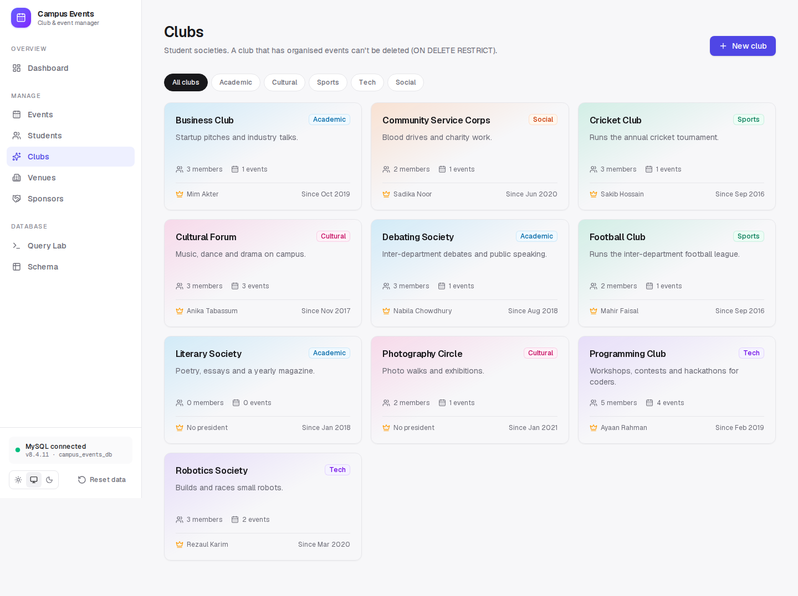
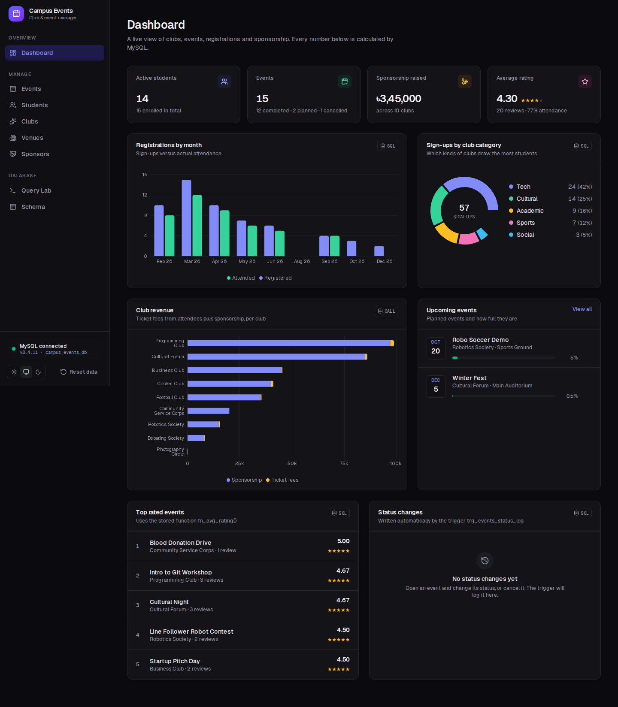
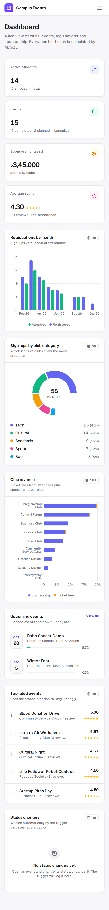

# Campus Club & Event Manager

A MySQL database project (CSE 364 – Database Systems) with a modern web dashboard on top.
The database models a university's clubs, events, venues, registrations, feedback and sponsors.
The web app lets you browse and edit all of it, run the stored procedures, watch the triggers fire, and execute the 31 project queries in the browser.

[](https://codespaces.new/Muktaditbf/Campus-Club-Event-Manager)



## Run it (nothing to install)

1. Click **Open in GitHub Codespaces** above, or on GitHub go to **Code → Codespaces → Create codespace on main**.
2. Wait for the setup to finish (about 2–3 minutes the first time). A MySQL 8.4 server starts and loads `01_schema.sql`, `02_data.sql` and `03_routines.sql`.
3. The app starts by itself and opens in a preview tab on port **3000**. If it doesn't, open the **Ports** tab and click the globe icon next to port 3000.

When you're done, stop the codespace from <https://github.com/codespaces> so it doesn't use your free hours.

<details>
<summary>Running it on your own computer instead</summary>

You need Node.js 20.9+ and MySQL 8.

```bash
mysql -u root -p < database/01_schema.sql
mysql -u root -p < database/02_data.sql
mysql -u root -p < database/03_routines.sql
cp .env.example .env.local   # then edit DB_PASSWORD
npm install
npm run dev                  # http://localhost:3000
```
</details>

## What the app does

| Page | What you can do | Database features it shows |
|---|---|---|
| **Dashboard** | KPIs, charts, upcoming events, top-rated events, recent status changes | `sp_club_revenue_report()` (cursor), `fn_avg_rating()`, aggregates, `GROUP BY` |
| **Events** | Filter, search, create, edit, delete, change status, cancel | `fn_fill_rate()`, `sp_cancel_event()`, `trg_events_status_log`, `ON DELETE CASCADE` |
| **Event page** | Register students, mark attendance, add feedback and sponsors | `sp_register_student()`, `trg_reg_seat_check`, `trg_feedback_attended`, `UNIQUE` keys |
| **Students** | Search and filter, add, edit, delete, manage club memberships | `UNIQUE(email)`, M:N bridge table `memberships`, cascades |
| **Clubs** | Category filter, members with roles, club income | `ENUM`s, `ON DELETE RESTRICT` (a club with events can't be deleted) |
| **Venues / Sponsors** | Full create, edit, delete | `CHECK (capacity > 0)`, `ON DELETE SET NULL`, `CHECK (amount > 0)` |
| **Query Lab** | Run Q1–Q31 from `database/queries.sql`, routine and trigger demos, or your own SQL | Each run is a transaction that is rolled back unless you tick **Keep changes** |
| **Schema** | Relationship diagram, every column, key, constraint, routine and trigger | Read live from `information_schema` |

Every database error is shown as a readable message. For example, giving feedback for a student who didn't attend shows the trigger's own text: *"Feedback allowed only after attending the event"*.
Many cards have a small **SQL** button that shows the statement behind them.
**Reset data** in the sidebar rebuilds the database from the SQL files whenever you want a clean start.

Light and dark themes are included, and the layout works on phones.

### Screenshots

| | |
|---|---|
|  |  |
| **Events** list with seat fill from `fn_fill_rate()` | **Event page**: registrations, attendance, feedback, sponsors |
|  |  |
| **Query Lab** showing a trigger rejecting an insert | **Schema** with ER diagram, keys and constraints |
|  |  |
| **Clubs** | **Dark mode** |

<p align="center"></p>

## The database

```
students ─┬─< memberships >── clubs ──< events >── venues
          ├─< registrations >───────────┤
          └─< feedback >────────────────┤
                    sponsors ──< event_sponsors >┘
                            event_status_log (filled by a trigger)
```

- **10 tables**: `students`, `clubs`, `memberships`, `venues`, `events`, `registrations`, `feedback`, `sponsors`, `event_sponsors`, `event_status_log`
- **Constraints**: primary and foreign keys with `CASCADE`, `RESTRICT` and `SET NULL` rules, `UNIQUE` keys, `CHECK` constraints, `ENUM`s
- **Functions**: `fn_fill_rate(event_id)`, `fn_avg_rating(event_id)`
- **Procedures**: `sp_register_student` (IF/ELSEIF validation with an OUT message), `sp_cancel_event`, `sp_club_revenue_report` (cursor)
- **Triggers**: `trg_events_status_log` (AFTER UPDATE), `trg_reg_seat_check` (BEFORE INSERT), `trg_feedback_attended` (BEFORE INSERT)
- **31 queries**: single table (Q1–Q10), joins (Q11–Q19), subqueries (Q20–Q27), set operations, view and DML (Q28–Q31)

### Files

| File | Purpose |
|---|---|
| `database/01_schema.sql` | Creates `campus_events_db` and the 10 tables (safe to re-run) |
| `database/02_data.sql` | Sample data |
| `database/03_routines.sql` | Functions, procedures and triggers (uses `DELIMITER`, for the `mysql` client) |
| `database/queries.sql` | The 31 queries. Q30 and Q31 change data |
| `database/demo.sql` | Quick calls of the routines |
| `database/onecompiler_all_in_one.sql` | Everything in one file for [OneCompiler](https://onecompiler.com/mysql). Generated by `python3 scripts/build_onecompiler.py` |

## Tech stack

Next.js 16 (App Router, Server Actions) · React 19 · TypeScript · Tailwind CSS 4 · Recharts · `mysql2` · MySQL 8.4

The app sends plain SQL through `mysql2` with no ORM, so every query in the UI is real SQL you can read in `src/lib/data.ts` and `src/lib/actions.ts`.

## Checks

GitHub Actions runs on every push and pull request. It:

1. loads the SQL files into a real MySQL 8.4 server with the `mysql` client;
2. runs all 31 queries and the routine demo;
3. checks that the OneCompiler file is current and runs on its own;
4. verifies row counts, routines and triggers;
5. builds the app, opens every page in Chromium, registers a student, triggers the feedback rule, and saves screenshots as an artifact.

## Changes from the original upload

- Split into `01_schema.sql`, `02_data.sql`, `03_routines.sql`, `queries.sql` and `demo.sql`, with the file names in the headers matching.
- `03_routines.sql` now uses `DELIMITER $$`. Without it, the `mysql` client splits each `BEGIN … END` body at the first `;` and fails.
- `01_schema.sql` creates and selects `campus_events_db` and drops existing tables first, so it can be re-run.
- `sp_register_student` also refuses unknown and inactive students.
- The OneCompiler all-in-one file now also includes the 31 queries, and it is generated from the split files so the two can't drift apart.
- Q15's comment now says what the query returns (club leaders only).
